# Smart Clinic Management System

### Architecture summary

This Spring Boot application uses both MVC and REST controllers. Thymeleaf templates are used for the Admin and Doctor dashboards, while REST APIs serve all other modules including Appointment, Patient Dashboard and Patient Record. The application interacts with two databases—MySQL (for patient, doctor, appointment, and admin data) and MongoDB (for prescriptions). All controllers route requests through a common service layer, which in turn delegates to the appropriate repositories including MySQL Repository and MongoDB Repository. MySQL uses JPA entities while MongoDB uses document models.

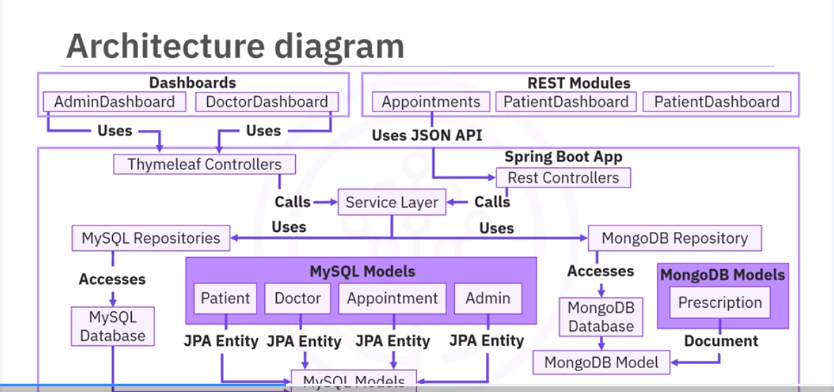

### Web page description 

The Index/Initial page where the user can choose one of 3 roles (admin/patient/doctor)

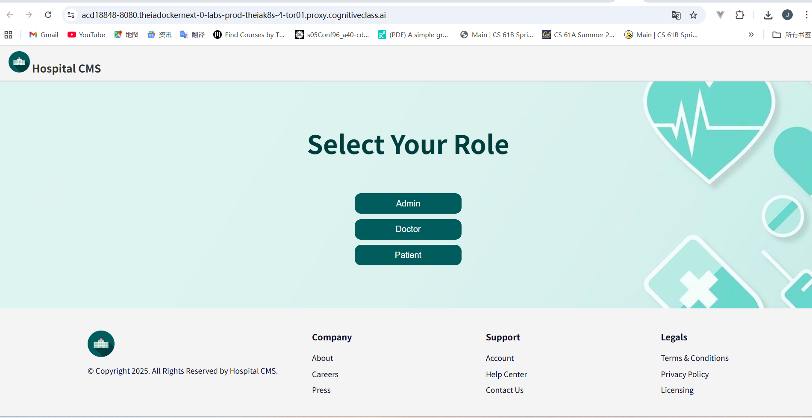

The admin/doctor should enter username and password first to log in.

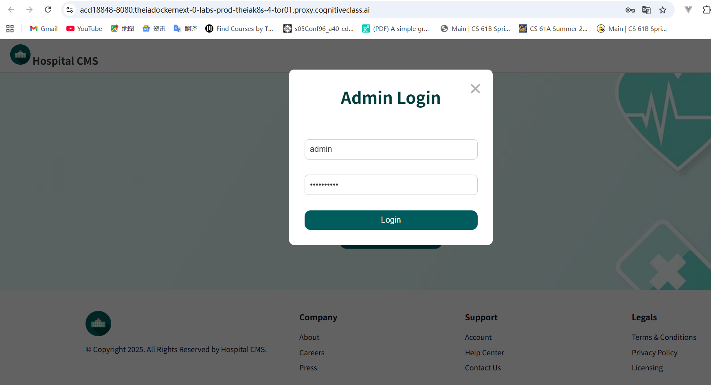

Admin dashboard. The admin can see all doctors and search & filter doctors. The admin can also add/delete a doctor.

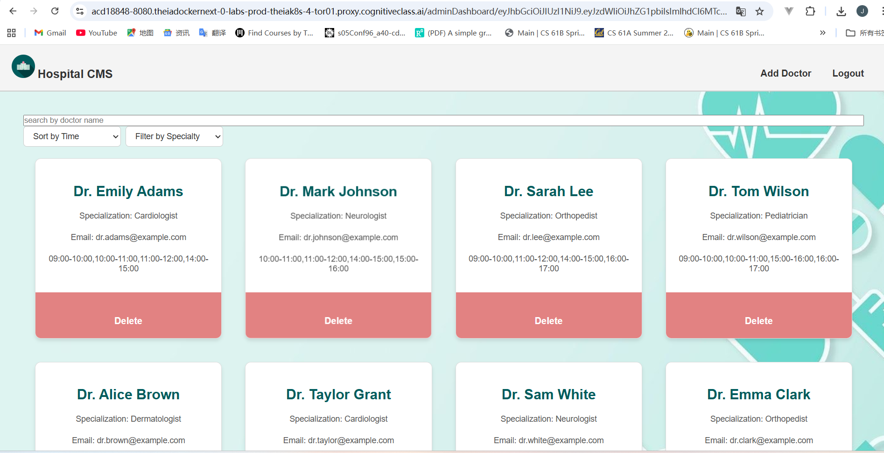

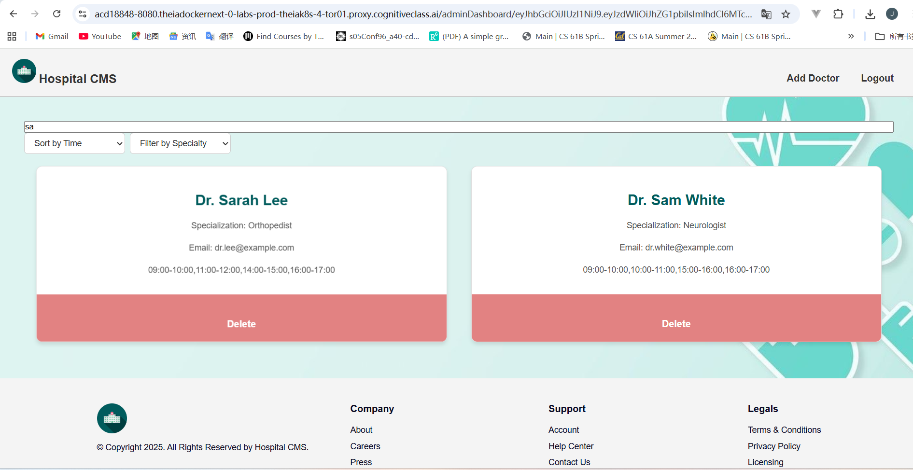

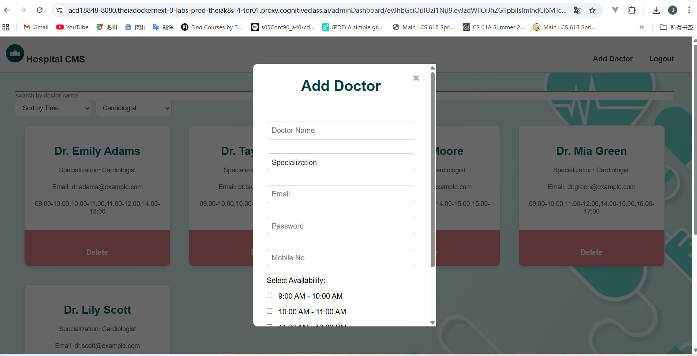

Doctor dashboard. The doctor can see appointments on a specific date and can add prescription.

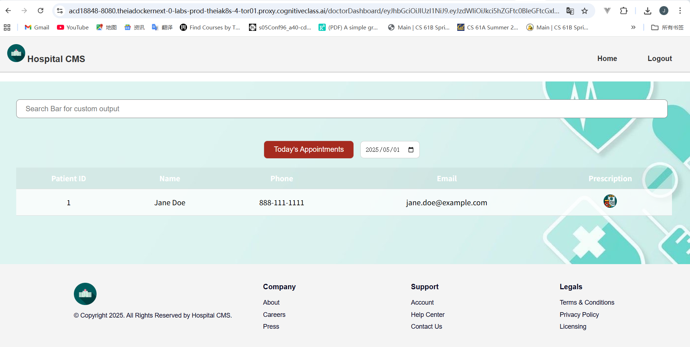

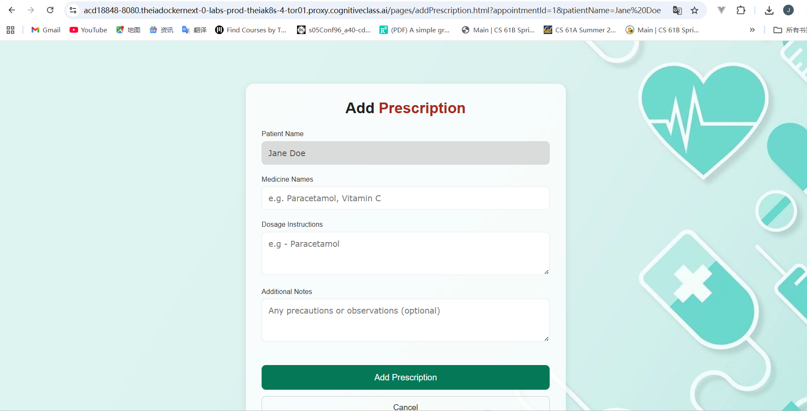

Patient Dashboard. The patient should sign up/ log in first.

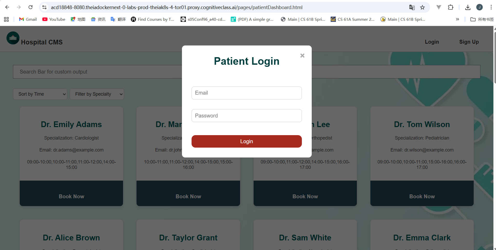

The patient can see his/her appointments and update upcoming appointments if need.

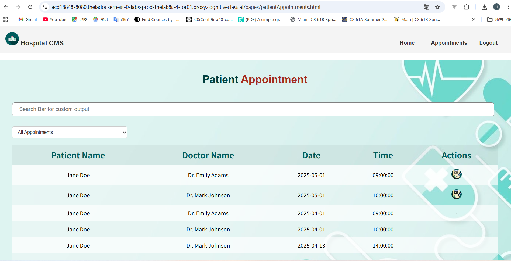

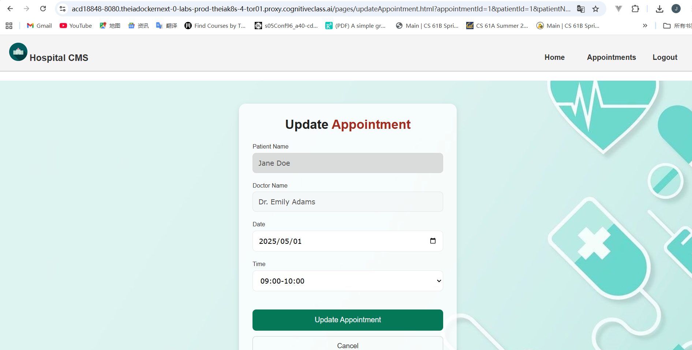